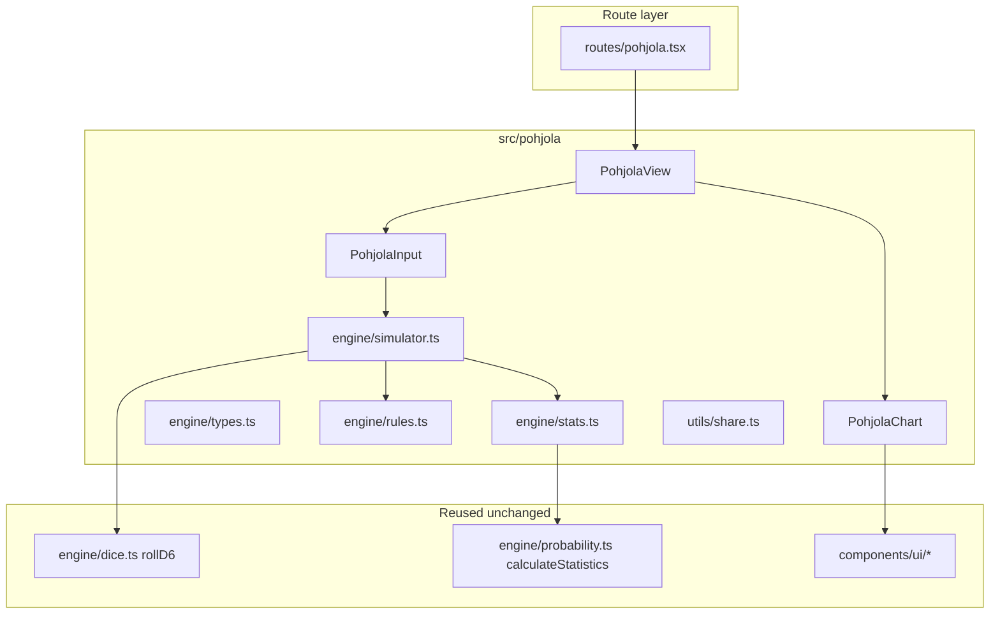

# Pohjola Simulator — Stage 1 Plan

## Goals

- New page at **`/pohjola`** (TanStack Router, same pattern as [`src/routes/magic.tsx`](src/routes/magic.tsx)).
- All code under **`src/pohjola/`** so the T9A combat engine and [`CombatView`](src/components/CombatView.tsx) stay untouched.
- **Stage 1:** full attack sequence + all attack-related special rules; **exclude** Will tests and Fear.
- **UI:** damage distribution bar chart (like [`ProbabilityChart`](src/components/ProbabilityChart.tsx)), header with expected damage + variance + **overall avg crit / avg block**, tooltips per bar with **conditional** avg crit & block for that damage value.
- **Docs:** `plans/Pohjola/attack-resolution.md` (see sibling file) is the canonical rules reference.

## Architecture



| Layer | Location | Responsibility |
|-------|----------|----------------|
| Route | [`src/routes/pohjola.tsx`](src/routes/pohjola.tsx) | Thin page: title, `?sim=` decode, render `PohjolaView` |
| UI | `src/pohjola/components/` | Inputs, run button, chart, share link |
| Engine | `src/pohjola/engine/` | One attack resolution + Monte Carlo loop |
| Docs | `plans/Pohjola/` | Rules, resolution order, metric definitions |
| Nav | [`src/components/Navbar.tsx`](src/components/Navbar.tsx) | Add "Pohjola" link |

**Reuse (read-only imports):** `rollD6` / `parseDiceExpression` from [`src/engine/dice.ts`](src/engine/dice.ts), `calculateStatistics` from [`src/engine/probability.ts`](src/engine/probability.ts), shadcn `Card` / `Button` / `Input` / `ChartContainer` from [`src/components/ui/`](src/components/ui/).

**Do not modify:** `simulator.ts`, `CombatView`, `DiceInput`, `ProbabilityChart` (copy patterns into `PohjolaChart` instead).

---

## Attack Resolution (canonical — see also attack-resolution.md)

### Order of operations

1. **Divine Truth [X]**: first X attack dice auto-succeed as **crits** (skip the hit roll entirely). Roll the rest.
2. **Hit roll**: remaining dice vs AS. die ≥ AS = hit.
3. **Crit determination**: `critThreshold = max(2, 6 - criticalStrike)`. If `criticalStrike = -1`, crits are impossible (threshold 7). die ≥ critThreshold = crit (also a hit); AS ≤ die < critThreshold = normal hit.
4. **Attacker rerolls**:
   - `attackerGoodRerolls`: reroll up to N failed attack dice ("all" = all failures).
   - `attackerBadTokens`: force-reroll up to N successful attack dice ("all" = all successes).
   - Reroll budget determined from the initial roll; each die rerolled at most once.
5. **Titanic Strikes [X]**: add X flat **normal** hits to the pool (no effect on complete miss). Crits are unaffected. Applied before defence and Block.
6. **Reverberating Strikes**: each hit in the current pool spawns one additional d6 attack die, resolved with the same AS / crit threshold and the remaining attacker-reroll budget (shared). Extra hits join the combined pool before defence.
7. **Block / Crush**: `effectiveBlock = max(0, block - crush)`. Convert up to `effectiveBlock` crits into **normal hits** (they still face the defence roll).
8. **Defence phase** (all normal hits — including Block-converted crits):
   - `defenceDice = normalHitCount + resilient`; roll all, sort descending, assign top `normalHitCount` rolls vs DS.
   - `defenderDivineTruth`: first N hits auto-save (no roll required).
   - `defenderGoodRerolls`: reroll up to N failed defence dice.
   - `defenderBadTokens`: force-reroll up to N successful defence dice.
   - die ≥ DS = hit negated (counted as a Block). die < DS = hit stands.
9. **Damage**: (remaining crits + surviving normal hits) = total hits → each hit = 1 HP.
10. **Lethality [X]**: add X extra hits to the pool (flat bonus, no effect if 0 hits).
10. **Reverberating Strikes**: each hit that contributed to final damage spawns one sub-attack (same params, `canReverberate: false`).

### Tracked metrics

| Metric | Definition |
|--------|------------|
| **Crits** | Total crit hits scored (post-Titanic, before Block rule) |
| **Blocks** | Normal hits negated by successful defence rolls (die ≥ DS in step 6) |
| **Damage** | Final HP lost (step 8 + Lethality), including Reverberating |

**Tooltip:** for bar at damage `d`: `P(damage = d)` + `E[crits | damage = d]` + `E[blocks | damage = d]`.

**Header:** `E[damage]`, variance, `E[crits]`, `E[blocks]` across all iterations.

---

## Engine design (`src/pohjola/engine/`)

### Types — `types.ts`

```ts
type RerollCount = 0 | 1 | 2 | "all";

interface PohjolaAttackParams {
  attackPool: number | string;        // dice count or expression
  as: 2 | 3 | 4 | 5 | 6;
  ds: 2 | 3 | 4 | 5 | 6;
  lethality: 0 | 1 | 2 | 3;
  criticalStrike: -1 | 0 | 1 | 2 | 3; // critThreshold = max(2, 6 - X); -1 = impossible
  crush: 0 | 1 | 2 | 3;
  block: 0 | 1 | 2 | 3;
  titanicStrikes: 0 | 1 | 2 | 3;     // flat +X normal hits added to pool (no effect on miss)
  resilient: 0 | 1 | 2 | 3;          // extra defence dice, pool + best N
  attackerGoodRerolls: RerollCount;   // reroll failed attack dice
  attackerBadTokens: RerollCount;     // force-reroll successful attack dice
  defenderGoodRerolls: RerollCount;   // reroll failed defence dice
  defenderBadTokens: RerollCount;     // force-reroll successful defence dice
  divineTruth: number;                // count of auto-crit hits (first N dice bypass roll)
  defenderDivineTruth: number;        // count of auto-save defence hits (first N hits auto-negated)
  reverberating: boolean;
  iterations?: number;                // default 10_000
}

interface PohjolaIterationOutcome {
  damage: number;
  crits: number;
  blocks: number;
}

interface PohjolaSimulationResults {
  damage: SimulationResults;          // from calculateStatistics(damage[])
  meanCrits: number;
  meanBlocks: number;
  byDamage: Record<number, {
    count: number;
    probability: number;
    avgCrits: number;
    avgBlocks: number;
  }>;
}
```

### Resolution — `simulator.ts` + `rules.ts`

- **`resolveAttack(params)`** → single `PohjolaIterationOutcome`.
- **`runPohjolaSimulation(params)`** → `PohjolaIterationOutcome[]`.
- **`rules.ts`:** pure helpers (`rollAttacks`, `applyAttackerRerolls`, `applyTitanic`, `resolveDefence`, `applyBlock`, `applyLethality`, `getCritThreshold`, `subtractRerollBudget`) with **Vitest** coverage in `src/pohjola/engine/__tests__/`.

**Reroll helpers** (apply to both attacker and defender):
- Good rerolls: count failures, reroll min(count, N) of them (or all if "all").
- Bad tokens: determined from the **initial** roll (pre-good-reroll), force-reroll min(count, N) of them.
- Each die rerolled at most once.

**Block / Crush:** `effectiveBlock = max(0, block - crush)` → **convert** min(crits, effectiveBlock) crits into normal hits (converted hits still face the defence roll).

**Reverberating:** for each hit in the post-Titanic pool, roll one additional d6 attack die through hit/crit classification and the remaining attacker-reroll budget (budget is shared and decremented after main attack). Extra hits are appended to the combined pool **before** Block and defence.

### Stats — `stats.ts`

- Run N iterations, collect `{ damage, crits, blocks }[]`.
- `damage[]` → `calculateStatistics` (reuse existing histogram).
- Build `byDamage` map for tooltip conditionals.
- `meanCrits` / `meanBlocks` = arithmetic means.

---

## UI design (`src/pohjola/components/`)

### `PohjolaInput.tsx`

- Card layout mirroring [`DiceInput`](src/components/DiceInput.tsx) / [`MagicSimulatorInput`](src/components/MagicSimulatorInput.tsx): core fields (pool, AS, DS) + accordion **Special rules** with X selectors.
- Reroll section: 4 separate selects (attacker good/bad, defender good/bad), each 0/1/2/all.
- **Simulate** button; optional auto-run from share URL.
- **Share:** `encodePohjolaShareState` in `src/pohjola/utils/share.ts` (v1 JSON + base64url, same pattern as [`src/utils/share.ts`](src/utils/share.ts)).

### `PohjolaChart.tsx`

- Fork layout from [`ProbabilityChart`](src/components/ProbabilityChart.tsx) (probability / cumulative toggle, bar colors by percentile, 0.1% filter).
- Relabel wounds → damage / HP.
- Header block:

```
EXPECTED DAMAGE     3.42
Variance: 1.21
Avg crits: 1.85    Avg blocks: 0.32
```

- Tooltip example:

```
4 damage: 12.4%
Avg crits: 2.1 · Avg blocks: 0.4
```

### `PohjolaView.tsx`

- Page shell (title styling like Magic page), wires input → engine → chart.

### Route + nav

- Add [`src/routes/pohjola.tsx`](src/routes/pohjola.tsx); run route codegen if the project uses `tsr generate` (per existing [`routeTree.gen.ts`](src/routeTree.gen.ts) workflow).
- [`Navbar.tsx`](src/components/Navbar.tsx): add `{ to: "/pohjola", label: "Pohjola", icon }` to `navLinks`.

---

## Testing strategy

| Test | Purpose |
|------|---------|
| Unit: crit threshold | X=-1 → no crits; X=1 → 5+ crits |
| Unit: Titanic | 2 hits + Titanic[1] → 4 hits pre-defence |
| Unit: Block/Crush | effectiveBlock = max(0, block - crush) |
| Unit: Lethality cap | bonus never exceeds damage dealt |
| Unit: Reverberating | sub-attack runs once, no chain |
| Unit: Resilient pool | 3 hits + Resilient[1] → roll 4, assign 3 best |
| Unit: Reroll counts | good/bad rerolls respect count and "all" |
| Statistical: large pool, AS 4+, DS 4+ | mean damage within tolerance vs analytic baseline |

Use Vitest alongside existing [`src/engine`](src/engine) tests; no changes to T9A test files.

---

## Implementation order

1. **Docs** — `attack-resolution.md` (done in this session via plan update).
2. **Engine types + base loop** — pool → hits → crit split → defence → damage (no specials).
3. **Rules module** — add specials one-by-one with tests.
4. **Stats + aggregation** — `byDamage` conditionals.
5. **UI input + view + chart**.
6. **Route, nav, share URLs**.
7. **Manual QA** — compare a few hand-calculated small pools.

---

## Out of scope (stage 2)

- Will tests, Fear, Versus mode, profile import.
