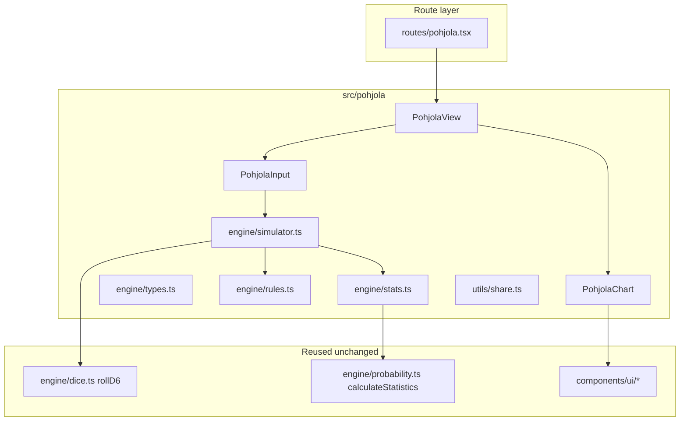

# Pohjola Simulator — Stage 1 Plan

## Goals

- New page at **`/pohjola`** (TanStack Router, same pattern as [`src/routes/magic.tsx`](src/routes/magic.tsx)).
- All code under **`src/pohjola/`** so the T9A combat engine and [`CombatView`](src/components/CombatView.tsx) stay untouched.
- **Stage 1:** full attack sequence + all attack-related special rules from [`plans/Pohjola/pohjola.md`](plans/Pohjola/pohjola.md); **exclude** Will tests and Fear.
- **UI:** damage distribution bar chart (like [`ProbabilityChart`](src/components/ProbabilityChart.tsx)), header with expected damage + variance + **overall avg crit / avg block**, tooltips per bar with **conditional** avg crit & block for that damage value.
- **Docs:** expand `plans/Pohjola/pohjola.md` (and add a mechanics spec file) before/during implementation.

## Architecture



| Layer | Location | Responsibility |
|-------|----------|----------------|
| Route | [`src/routes/pohjola.tsx`](src/routes/pohjola.tsx) | Thin page: title, `?sim=` decode, render `PohjolaView` |
| UI | `src/pohjola/components/` | Inputs, run button, chart, share link |
| Engine | `src/pohjola/engine/` | One attack resolution + Monte Carlo loop |
| Docs | `plans/Pohjola/` | Rules, resolution order, metric definitions |
| Nav | [`src/components/Navbar.tsx`](src/components/Navbar.tsx) | Add “Pohjola” link |

**Reuse (read-only imports):** `rollD6` / `parseDiceExpression` from [`src/engine/dice.ts`](src/engine/dice.ts), `calculateStatistics` from [`src/engine/probability.ts`](src/engine/probability.ts), shadcn `Card` / `Button` / `Input` / `ChartContainer` from [`src/components/ui/`](src/components/ui/).

**Do not modify:** `simulator.ts`, `CombatView`, `DiceInput`, `ProbabilityChart` (copy patterns into `PohjolaChart` instead).

---

## Documentation (first deliverable)

Expand [`plans/Pohjola/pohjola.md`](plans/Pohjola/pohjola.md) and add **`plans/Pohjola/attack-resolution.md`** with:

### Core attack loop (from doc)

1. Roll **attack pool** (N d6).
2. **Hit:** die ≥ **AS** (Attack Skill).
3. Apply attacker modifiers (rerolls, tokens, Divine Truth, Titanic, etc.) — order fixed in spec.
4. **Defence:** for each hit, roll defence **except** hits from attack dice showing **6** (auto-hit, no defence roll).
5. **Critical hit (defence success):** defence die ≥ effective **DS** (Defence Skill), modified by attacker **Critical Strike [X]** (`effectiveDS = DS - X`, clamp 2–6).
6. Apply **Block [X]** (defender: ignore up to X critical hits) and **Crush [X]** (attacker: ignore up to X Block cancellations).
7. Remaining hits → **HP damage**; apply **Lethality [X]** (extra HP, capped at damage dealt this attack).
8. **Reverberating Strikes:** each hit that remains after step 7 spawns one **red fury** sub-attack (same stats, `canReverberate: false`).

### Tracked metrics (answers “nice to have” crit/block)

| Metric | Definition |
|--------|------------|
| **Crit** | Defence successes: critical hits that **would** remove a hit (before Block/Crush adjustments), per iteration |
| **Block** | Critical hits **negated** by Block [X] (after Crush), per iteration |
| **Damage** | Final HP lost (base hits + Lethality), per iteration |

**Tooltip:** for bar at damage `d`, show `P(damage = d)` plus `E[crit \| damage = d]` and `E[block \| damage = d]` (computed from iteration buckets).

**Header:** `E[damage]`, variance, `E[crit]`, `E[block]` across all iterations.

### Rule parameters

- Each `[X]` rule: UI select **0 / 1 / 2 / 3** (0 = off); **Critical Strike** also allows **-1** (increases effective DS).
- **Good Rerolls / Bad Tokens:** count 1, 2, or “all” (map to engine enum).
- **Divine Truth [X]:** X preset faces (1–6) applied to first X attack dice before rolling the rest.
- **Resilient [X]:** document default from example — *3 hits, Resilient [1] → roll 4 defence dice, assign the **3 highest** rolls to the 3 hits* (pool + extra dice, take best per hit). **Flag in doc:** you chose “Other” for Resilient; confirm this interpretation at implementation time or adjust in one place in `rules.ts`.

### Out of scope (stage 2)

- Will tests, Fear, Versus mode, profile import.

---

## Engine design (`src/pohjola/engine/`)

### Types — `types.ts`

```ts
// Simplified sketch
interface PohjolaAttackParams {
  attackPool: number | string;   // dice count or expression
  as: 2 | 3 | 4 | 5 | 6;
  ds: 2 | 3 | 4 | 5 | 6;
  lethality: 0 | 1 | 2 | 3;
  criticalStrike: -1 | 0 | 1 | 2 | 3;
  crush: 0 | 1 | 2 | 3;
  block: 0 | 1 | 2 | 3;
  titanicStrikes: 0 | 1 | 2 | 3;
  resilient: 0 | 1 | 2 | 3;
  goodRerolls: 0 | 1 | 2 | "all";
  badTokens: 0 | 1 | 2 | "all";
  divineTruth: number[];         // length = divineTruthX
  reverberating: boolean;
  iterations?: number;           // default 10_000
}

interface PohjolaIterationOutcome {
  damage: number;
  crits: number;
  blocks: number;
}

interface PohjolaSimulationResults {
  damage: SimulationResults;     // from calculateStatistics(damage[])
  meanCrits: number;
  meanBlocks: number;
  byDamage: Record<number, {
    count: number;
    probability: number;
    avgCrits: number;
    avgBlocks: number;
  }>;
}
```

### Resolution — `simulator.ts` + `rules.ts`

- **`resolveAttack(params, options)`** → single `PohjolaIterationOutcome` (recursive only for Reverberating sub-attacks).
- **`runPohjolaSimulation(params)`** → `PohjolaSimulationResults`.
- **`rules.ts`:** pure helpers (`applyRerolls`, `applyTitanic`, `resolveDefence`, `applyLethality`, etc.) with **Vitest** coverage in `src/pohjola/engine/__tests__/`.

**Defence phase (Resilient default):**

- `defenceDice = hitCount + resilientX`
- Roll `defenceDice` d6; sort descending; use top `hitCount` rolls vs `effectiveDS`.
- Skip defence entirely for attack dice that rolled 6 (track per-hit whether it was a natural 6).

**Block / Crush:** count raw crits first → apply Block cap → Crush reduces block applications → final cancelled hits.

**Reverberating:** after main damage, for each remaining hit (post-defence), call `resolveAttack` with `reverberating: false`; sum damage/crits/blocks into parent outcome.

### Stats — `stats.ts`

- Run N iterations, collect `{ damage, crits, blocks }[]`.
- `damage` → `calculateStatistics` (reuse existing histogram).
- Build `byDamage` map for tooltip conditionals.
- Global `meanCrits` / `meanBlocks` = arithmetic means.

---

## UI design (`src/pohjola/components/`)

### `PohjolaInput.tsx`

- Card layout mirroring [`DiceInput`](src/components/DiceInput.tsx) / [`MagicSimulatorInput`](src/components/MagicSimulatorInput.tsx): core fields (pool, AS, DS) + accordion **Special rules** with X selectors.
- **Simulate** button; optional auto-run from share URL.
- **Share:** `encodePohjolaShareState` in `src/pohjola/utils/share.ts` (v1 JSON + base64url, same pattern as [`src/utils/share.ts`](src/utils/share.ts)).

### `PohjolaChart.tsx`

- Fork layout from [`ProbabilityChart`](src/components/ProbabilityChart.tsx) (probability / cumulative toggle, bar colors by percentile, 0.1% filter).
- Relabel **wounds → damage / HP**.
- Header block:

```
EXPECTED DAMAGE     3.42
Variance: 1.21
Avg crits: 1.85    Avg blocks: 0.32
```

- Tooltip example:

```
4 damage: 12.4%
Avg crits: 2.1 · Avg blocks: 0.4
```

### `PohjolaView.tsx`

- Page shell (title styling like Magic page), wires input → engine → chart.

### Route + nav

- Add [`src/routes/pohjola.tsx`](src/routes/pohjola.tsx); run route codegen if the project uses `tsr` generate (per existing [`routeTree.gen.ts`](src/routeTree.gen.ts) workflow).
- [`Navbar.tsx`](src/components/Navbar.tsx): add `{ to: "/pohjola", label: "Pohjola", icon }` to `navLinks`.

---

## Testing strategy

| Test | Purpose |
|------|---------|
| Unit: `effectiveDS`, Block/Crush ordering | Deterministic edge cases |
| Unit: attack 6 skips defence | Doc rule |
| Unit: Lethality cap | Never exceeds damage dealt |
| Unit: Reverberating | Sub-attack runs once, no chain |
| Statistical: large pool, AS 4+, DS 4+ | Mean damage within tolerance vs analytic baseline (optional) |

Use Vitest alongside existing [`src/engine`](src/engine) tests; no changes to T9A test files.

---

## Implementation order

1. **Docs** — `attack-resolution.md` + update `pohjola.md` (metrics, stage boundaries, Resilient note).
2. **Engine types + base loop** — pool → hits → defence → damage (no rules).
3. **Rules module** — add specials one-by-one with tests.
4. **Stats + aggregation** — `byDamage` conditionals.
5. **UI input + view + chart**.
6. **Route, nav, share URLs**.
7. **Manual QA** — compare a few hand-calculated small pools.

---

## Open confirmation (before coding Resilient)

You selected **Other** for Resilient. The plan uses the doc example: **hits + X dice, assign best `hitCount` rolls**. Reply if you want per-hit “roll 1+X dice, any success counts” instead—we will only change `resolveDefence` in `rules.ts`.
